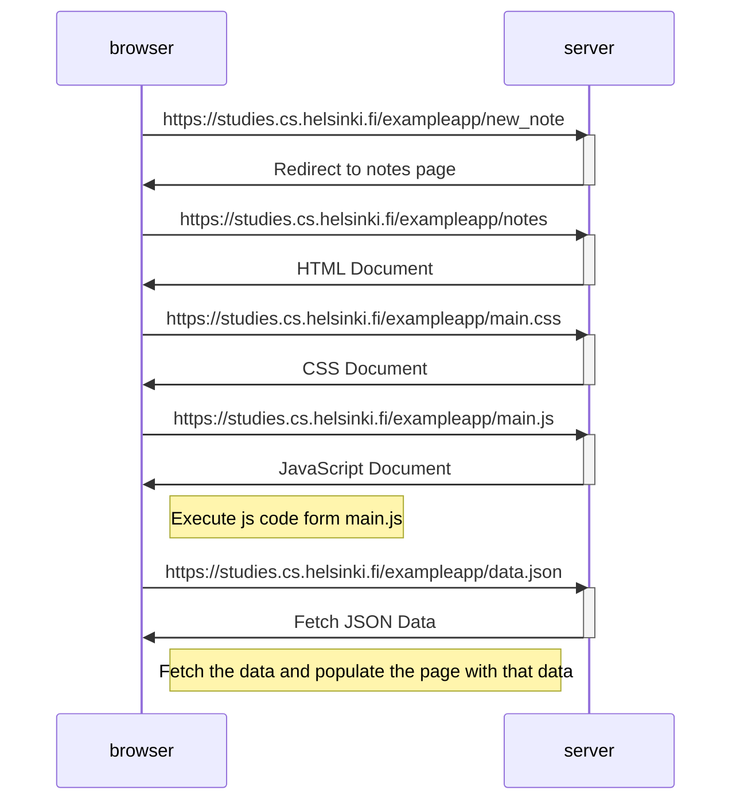

```mermaid
sequenceDiagram
    participant browser
    participant server
    
    browser->>server: https://studies.cs.helsinki.fi/exampleapp/new_note
    activate server
    server->>browser: Redirect to notes page
    deactivate server

    browser->>server: https://studies.cs.helsinki.fi/exampleapp/notes
    activate server
    server->>browser: HTML Document
    deactivate server

    browser->>server: https://studies.cs.helsinki.fi/exampleapp/main.css
    activate server
    server->>browser: CSS Document
    deactivate server

    browser->>server: https://studies.cs.helsinki.fi/exampleapp/main.js
    activate server
    server->>browser: JavaScript Document
    deactivate server

    Note right of browser: Execute js code form main.js

    browser->>server: https://studies.cs.helsinki.fi/exampleapp/data.json
    activate server
    server->>browser: Fetch JSON Data
    deactivate server
    Note right of browser: Fetch the data and populate the page with that data
```